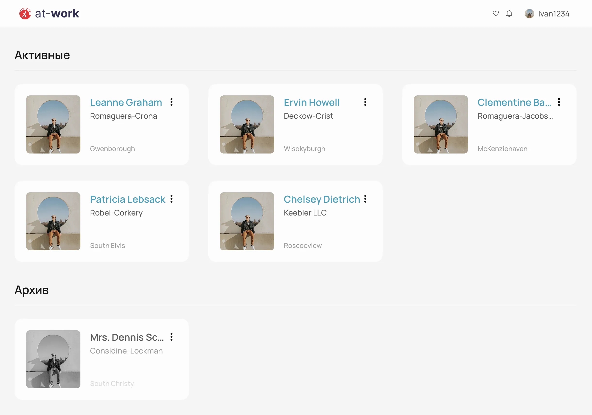

# At-work 

React-приложение, получающее данные через API, для работы с пользовательскими карточками.

## Демо

🟢 **Live:** [https://at-work-test-assignment.web.app/](https://at-work-test-assignment.web.app/)




## Стек технологий

- **React 19** + **TypeScript**
- **Vite** — сборщик проекта
- **Zustand** — управление состоянием
- **React Query** — получение данных с API
- **React Hook Form** + **Zod** — работа с формами и валидация
- **Sass (SCSS Modules)** — стилизация
- **React Router DOM** — навигация
- **Firebase** — деплой

## Как запустить проект

1. Установите зависимости:
   ```bash
   npm install
   ```

2. Запустите проект в режиме разработки:
   ```bash
   npm run dev
   ```

## Скрипты

- `npm run dev` — запуск сервера для разработки
- `npm run build` — сборка проекта для продакшена
- `npm run lint` — запуск проверки кода (ESLint)
- `npm run format` — форматирование кода (Prettier)
- `npm run preview` — предпросмотр собранного проекта
